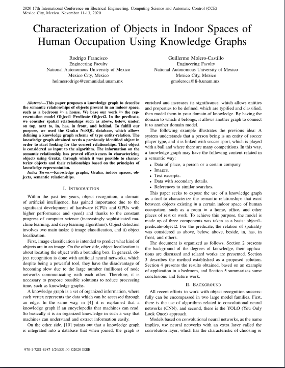

# CCE 2020

<!--Paper ID: 45-->

## Characterization of Objects in Indoor Spaces of Human Occupation Using Knowledge Graphs

```sh
Status:
Phase 1 Approved
Phase 2 Pending
```

### Authors

- [Rodrigo Francisco](holmesrodrigo@comunidad.unam.mx)
- [Guillermo Molero-Castillo](gmoleroca@fi-b.unam.mx)

### Abstract

This paper proposes a knowledge graph to describe
the semantic relationships of objects present in an indoor space,
such as a bedroom in a house. We base our work in the rep-
resentation model Object1–Predicate–Object2. In the predicate,
we consider spatial relationships such as above, below, under,
on top, next to, in, has, in front, and behind. To fulfill our
purpose, we used the Grakn NoSQL database, which allows
defining a knowledge graph schema of type entity-relation. The
knowledge graph obtained needs a previously identified object in
order to start looking for the correct relationships. That object
is considered as input to the algorithm. The information on the
semantic relationship has proved effectiveness in characterizing
objects using Grakn, through which it was possible to charac-
terize objects and their relationships based on the principles of
knowledge representation.

### Keywords

Knowledge graphs, Grakn, indoor spaces, objects, semantic relationships.

<div style="display: flex;">
  <div style="margin-left:1em; flex: 50%;">
    <h3>Sections</h3>
    <ol>
    <li> Introduction</li>
    <li> Background</li>
    <li> Method</li>
    <li> Result</li>
    <li> Conclusion</li>
    <li> References  </li>
    </ol>  
  </div>
  
</div>

### Notes:

- [CCE 2020 website](https://cce.cinvestav.mx/)
- Conference requirements at [CINVESTAV](https://cce.cinvestav.mx/author-information)
- Submitted to [Easy Chair](https://easychair.org/conferences/?conf=cce20200)
  <!--(username: rhodstar)-->
- IEEE format verification at [IEEE PDF eXpress](http://www.pdf-express.org/) (Conference ID is required)
<!--50788x-->

[Final version (Approved by PDF eXpress)](revisions/PID6614115.pdf)
